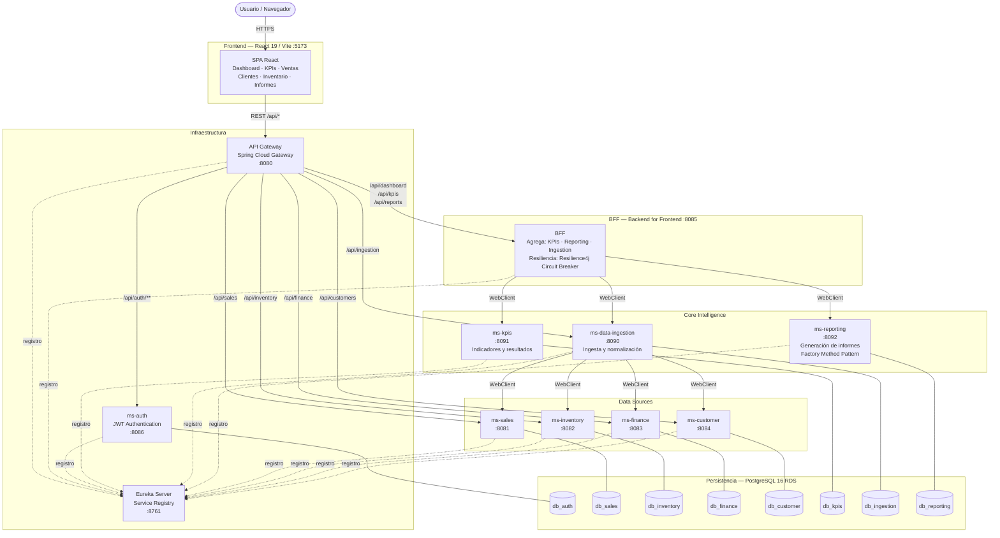

# Diagrama de Componentes — Grupo Cordillera

Usa el bloque Mermaid de abajo para generar el diagrama. Pégalo en cualquier editor compatible (Mermaid Live, GitHub, Notion, etc.).

---

## Arquitectura del sistema

---

## Descripción de los flujos principales

| Flujo | Ruta |
|---|---|
| Login | Frontend → Gateway → ms-auth → db_auth |
| Dashboard / KPIs | Frontend → Gateway → BFF → ms-kpis → db_kpis |
| Ingesta de datos | Frontend → Gateway → BFF → ms-data-ingestion → ms-sales/inventory/finance/customer |
| Generación de informes | Frontend → Gateway → BFF → ms-reporting → db_reporting |
| CRUD Ventas | Frontend → Gateway → ms-sales → db_sales |
| CRUD Clientes | Frontend → Gateway → ms-customer → db_customer |
| CRUD Inventario | Frontend → Gateway → ms-inventory → db_inventory |
| CRUD Finanzas | Frontend → Gateway → ms-finance → db_finance |

---

## Tecnologías por capa

| Componente | Tecnología |
|---|---|
| Frontend | React 19, Vite, Tailwind CSS, React Router, Recharts, Axios |
| API Gateway | Spring Cloud Gateway (reactivo) |
| Service Registry | Eureka Server |
| BFF | Spring Boot 3.5.6, WebClient, Resilience4j |
| Microservicios | Spring Boot 3.5.6, Java 21, Spring Data JPA |
| Autenticación | JWT (ms-auth) |
| Base de datos | PostgreSQL 16 (RDS en AWS) |
| Contenerización | Docker, AWS ECR |
| Infraestructura | AWS VPC, EC2 t3.micro, RDS |
