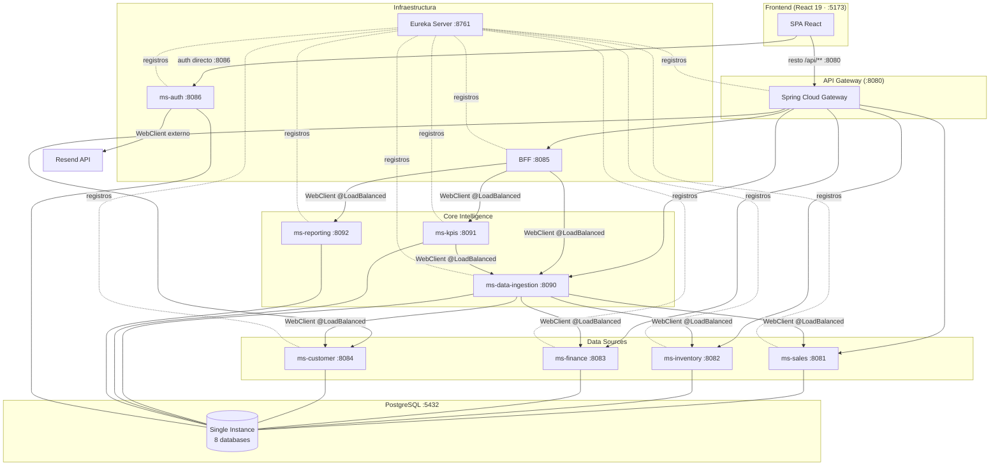

# PROJECT_MEMORY.md — Grupo Cordillera
> Documento de memoria viva del proyecto. Última actualización: 2026-05-07.
> Generado para permitir que otro agente IA continúe el desarrollo sin perder contexto.

---

## 1. RESUMEN EJECUTIVO

**Grupo Cordillera** es un panel de gestión corporativa (holding multisucursal) con arquitectura de microservicios full-stack.

- **Backend**: 10 servicios Spring Boot 4.0.5 / Java 21 en monorepo Maven
- **Frontend**: SPA React 19 + Vite 8 + Tailwind CSS v4
- **Estado actual**: todos los servicios dockerizados y funcionales; login real integrado; flujo de recuperación de contraseña operativo vía Resend API
- **Rama activa**: `hotfix/integracion-frrontend-backend`
- **Último commit**: `68528f4` — `hotfix/integracion: recovery_pass - create_acc - mod. ms_auth - dashboard y pages frontend`

**Credenciales de prueba (seed en BD)**:
| Email | Password | Rol |
|---|---|---|
| admin@cordillera.cl | Admin1234! | ADMIN |
| usuario@cordillera.cl | Admin1234! | USER |

**RESTRICCIÓN DE DOMINIO**: solo se permiten emails `@cordillera.cl` o el correo autorizado `fe.ulloao@duocuc.cl`.

---

## 2. ARQUITECTURA GENERAL



**REGLA CRÍTICA**: el frontend llama a `ms-auth` **directamente en el puerto 8086**, NO a través del API Gateway. El gateway no tiene ruta para `/api/auth/**`.

---

## 3. ESTRUCTURA DEL PROYECTO

```
Fullstack3/
├── .env                          # NO commitear — contiene RESEND_API_KEY etc.
├── .env.example                  # Sí commitear — template de variables
├── .gitignore                    # Ignora .env, .env.local, .env.*.local
├── docker-compose.yml            # Orquestación completa (10 servicios + postgres)
└── cordillera/                   # Monorepo Maven (packaging pom)
    ├── pom.xml                   # Root: Spring Boot 4.0.5, Java 21, SC 2025.1.1
    ├── init-databases.sql        # Crea 8 bases de datos en PostgreSQL al iniciar
    ├── data-sources/             # (packaging pom)
    │   ├── ms-sales/             # :8081 — db_sales
    │   ├── ms-inventory/         # :8082 — db_inventory
    │   ├── ms-finance/           # :8083 — db_finance
    │   └── ms-customer/          # :8084 — db_customer
    ├── core-intelligence/        # (packaging pom)
    │   ├── ms-data-ingestion/    # :8090 — db_ingestion
    │   ├── ms-kpis/              # :8091 — db_kpis
    │   └── ms-reporting/         # :8092 — db_reporting
    ├── infraestructure/          # (packaging pom)
    │   ├── eureka-server/        # :8761 — registro de servicios
    │   ├── api-gateway/          # :8080 — Spring Cloud Gateway
    │   ├── bff/                  # :8085 — Backend for Frontend
    │   └── ms-auth/              # :8086 — autenticación JWT
    └── frontend/
        └── grupoCordillera/      # React 19 + Vite 8 + Tailwind v4
```

---

## 4. STACK TECNOLÓGICO

### Backend
| Tecnología | Versión | Uso |
|---|---|---|
| Java | 21 | Runtime |
| Spring Boot | 4.0.5 | Framework base |
| Spring Cloud | 2025.1.1 | BOM para SC deps |
| Spring Cloud Gateway | (SC BOM) | API Gateway reactivo |
| Netflix Eureka | (SC BOM) | Service Discovery |
| Resilience4j | (SC BOM) | Circuit Breaker en BFF |
| WebFlux / WebClient | (SB 4) | HTTP reactivo entre MS |
| Spring Security | (SB 4) | Auth + JWT filter |
| JJWT | 0.12.6 | Generación/validación de tokens |
| Flyway | (SB 4) | Migraciones DB (ms-auth + core-intelligence) |
| Hibernate/JPA | (SB 4) | ORM (data-sources usan ddl-auto=update) |
| PostgreSQL | 16-alpine | BD única con 8 schemas |
| Lombok | (SB 4) | Reducción de boilerplate |
| Resend API | externo | Email transaccional (reset password) |

### Frontend
| Tecnología | Versión | Uso |
|---|---|---|
| React | 19.2.5 | UI Framework |
| Vite | 8.0.9 | Build tool |
| Tailwind CSS | v4 (PostCSS) | Estilos — usa `@import "tailwindcss"` + `@theme` |
| React Router | 7.15.0 | Routing SPA |
| Axios | 1.16.0 | HTTP client |
| Recharts | 3.8.1 | Gráficas (Bar, Line) |
| Lucide React | 1.14.0 | Iconos |

---

## 5. ESTADO REAL DEL DESARROLLO (2026-05-07)

### Servicios Backend — Estado en Docker
| Servicio | Puerto | DB | Estado |
|---|---|---|---|
| eureka-server | 8761 | — | Funcional |
| api-gateway | 8080 | — | Funcional |
| bff | 8085 | — | Funcional |
| ms-auth | 8086 | db_auth | Funcional (Flyway V1-V3 ejecutados) |
| ms-sales | 8081 | db_sales | Funcional |
| ms-inventory | 8082 | db_inventory | Funcional |
| ms-finance | 8083 | db_finance | Funcional |
| ms-customer | 8084 | db_customer | Funcional |
| ms-data-ingestion | 8090 | db_ingestion | Funcional |
| ms-kpis | 8091 | db_kpis | Funcional |
| ms-reporting | 8092 | db_reporting | Funcional |

### Frontend — Estado de Páginas
| Página | Ruta | Estado | Datos |
|---|---|---|---|
| LoginPage | /login | Integrado con ms-auth real | authApi.login() |
| RegisterPage | /register | Integrado con ms-auth real | authApi.register() |
| ForgotPasswordPage | /forgot-password | Integrado con Resend | authApi.forgotPassword() |
| ResetPasswordPage | /reset-password | Integrado | authApi.resetPassword() |
| DashboardPage | / | Mock (datos hardcoded) | No conectado a BFF aún |
| SalesPage | /sales | Mock | No conectado a ms-sales aún |
| InventoryPage | /inventory | Mock | No conectado a ms-inventory aún |
| FinancePage | /finance | Mock | No conectado a ms-finance aún |
| CustomersPage | /customers | Mock | No conectado a ms-customer aún |
| ReportsPage | /reports | Mock | No conectado a ms-reporting aún |
| KpisPage | /kpis | Mock | No conectado a ms-kpis aún |

---

## 6. DECISIONES TÉCNICAS CLAVE

### 6.1 ms-auth fuera del API Gateway
El frontend llama a `http://localhost:8086` directamente. El api-gateway NO tiene ruta para `/api/auth/**`. Motivo: simplicidad de despliegue inicial y evitar configurar autenticación circular (el gateway necesitaría llamar a auth para validar rutas que van a auth).

### 6.2 Tailwind CSS v4 — NO usar tailwind.config.js
Tailwind v4 ignora completamente el archivo `tailwind.config.js` para la extensión de colores. Los colores custom DEBEN estar en `index.css` usando el bloque `@theme`:
```css
/* src/index.css — CORRECTO */
@import "tailwindcss";
@theme {
  --color-brand-dark: #0f172a;
  --color-brand-light: #f1f5f9;
  --color-brand-accent: #2563eb;
}
```
Si se definen colores en `tailwind.config.js extend.colors`, las clases como `bg-brand-accent` NO se generan.

### 6.3 Eureka — eureka-server SOLO en su propio módulo
El `spring-cloud-starter-netflix-eureka-server` **NO debe estar en el pom.xml raíz**. Si está en el root pom, todos los módulos lo heredan y causa `NullPointerException: CloudEurekaClient.getApplications()` en todos los MS clientes. Solo debe estar en `infraestructure/eureka-server/pom.xml`.

### 6.4 DataSource autoconfigure — excluir en servicios sin JPA
`eureka-server`, `bff` y `api-gateway` no usan base de datos. Deben excluir explícitamente en su `application.yml`:
```yaml
spring:
  autoconfigure:
    exclude:
      - org.springframework.boot.jdbc.autoconfigure.DataSourceAutoConfiguration
      - org.springframework.boot.hibernate.autoconfigure.HibernateJpaAutoConfiguration
      - org.springframework.boot.autoconfigure.flyway.FlywayAutoConfiguration
```

### 6.5 FlywayConfig explícito en ms-auth
Spring Boot 4.x no autoconfigura Flyway de la misma manera que versiones anteriores cuando hay configuración personalizada. `ms-auth` tiene un bean `FlywayConfig.java` explícito con `@Bean` que inyecta el `DataSource`. Si se elimina, las migraciones no se ejecutan en Docker.

### 6.6 Resend — usar onboarding@resend.dev como from-email
El dominio `cordillera.cl` no existe ni está verificado en Resend. El from-email DEBE ser `onboarding@resend.dev` (dominio de prueba de Resend que no requiere verificación). Cambiarlo a cualquier otro dominio personalizado causará error 403 de Resend.

### 6.7 Flyway en data-sources — ddl-auto=update
Los data-sources (ms-sales, ms-inventory, ms-finance, ms-customer) usan `spring.jpa.hibernate.ddl-auto=update` en Docker (no validate) porque Flyway no siempre corre antes de JPA en el arranque. Esto es acceptable para desarrollo.

### 6.8 Dockerfiles — copiar todos los pom.xml del monorepo
Los Dockerfiles de cada MS deben copiar **todos** los `pom.xml` del monorepo completo (no solo la cadena padre-hijo del módulo) para que Maven pueda resolver el árbol de módulos. Si falta algún `pom.xml`, Maven falla con "Child module does not exist".

### 6.9 ms-data-ingestion — path de migración
El archivo de migración de `ms-inventory` estuvo en la ruta incorrecta `db.migration/` (con punto) en vez de `db/migration/` (con slash). Fue copiado a la ruta correcta. Existe un archivo duplicado en la ruta incorrecta que puede ignorarse.

---

## 7. FLUJO DE DESARROLLO

### Cómo levantar el entorno completo
```bash
# Desde Fullstack3/
docker compose up --build -d

# Reconstruir solo un servicio
docker compose up ms-auth --build -d

# Ver logs
docker compose logs ms-auth -f
```

### Variables de entorno requeridas (en Fullstack3/.env)
```env
RESEND_API_KEY=re_xxxxxxxxxxxx
RESEND_FROM_EMAIL=onboarding@resend.dev
FRONTEND_URL=http://localhost:5173
JWT_SECRET=cordillera-secret-key-2026-grupo-fullstack3-muy-segura
```

### Levantar frontend
```bash
cd cordillera/frontend/grupoCordillera
npm install
npm run dev
# Disponible en http://localhost:5173
```

### Git Workflow
- El usuario usa **GitHub Desktop** para commits y push
- **NUNCA** hacer `git commit` ni `git push` sin solicitud explícita del usuario
- Rama principal de trabajo: `develop`
- Feature branches: `feature/SCRUM-XX`
- Commits de squash al finalizar un feature

---

## 8. BASE DE DATOS

### PostgreSQL — instancia única, múltiples DBs
Todas las bases se crean en `init-databases.sql` al iniciar el contenedor de Postgres por primera vez.

| DB | Servicio dueño | Tablas principales |
|---|---|---|
| db_auth | ms-auth | `users`, `password_reset_tokens` |
| db_sales | ms-sales | ventas, sucursales |
| db_inventory | ms-inventory | productos, stock |
| db_finance | ms-finance | balances, periodos |
| db_customer | ms-customer | clientes, segmentos |
| db_ingestion | ms-data-ingestion | snapshots consolidados |
| db_kpis | ms-kpis | `indicador`, `periodo`, `objetivo`, `resultado` |
| db_reporting | ms-reporting | reportes generados |

### ms-auth — Migraciones Flyway
- **V1** (`V1__create_users_table.sql`): tabla `users` (id, email, password_hash, role, activo, created_at, updated_at)
- **V2** (`V2__seed_admin.sql`): inserta `admin@cordillera.cl` y `usuario@cordillera.cl` (password: `Admin1234!`, BCrypt)
- **V3** (`V3__create_password_reset_tokens.sql`): tabla `password_reset_tokens` (id, token, user_email, expires_at, used)

### ms-kpis — Schema
```sql
indicador (id, codigo, nombre, tipo, unidad, formula)
periodo   (id, anio, mes, trimestre, fecha_inicio, fecha_fin)
objetivo  (id, indicador_id FK, periodo_id FK, valor_meta, umbral_alerta)
resultado (id, indicador_id FK, periodo_id FK, valor_real, porcentaje_cumplimiento, estado)
```

---

## 9. APIs — ENDPOINTS DOCUMENTADOS

### ms-auth (:8086) — `/api/auth/**`
| Método | Endpoint | Auth | Request Body | Response |
|---|---|---|---|---|
| POST | /api/auth/register | No | `{email, password, role?}` | `{token, email, role, expiresIn}` |
| POST | /api/auth/login | No | `{email, password}` | `{token, email, role, expiresIn}` |
| POST | /api/auth/forgot-password | No | `{email}` | `{message}` |
| POST | /api/auth/reset-password | No | `{token, newPassword}` | `{message}` |
| POST | /api/auth/change-password | Bearer JWT | `{currentPassword, newPassword}` | `{message}` |
| GET | /api/auth/validate | Bearer JWT | — | `{email, status: "valid"}` |

**IMPORTANTE**: NO existe `/api/auth/me`. El perfil del usuario se construye desde el token o desde el contexto de sesión guardado.

### BFF (:8085 vía Gateway :8080) — `/api/dashboard/**`
| Método | Endpoint | Auth | Response |
|---|---|---|---|
| GET | /api/dashboard | Bearer JWT | `{summary, kpis[], reportesRecientes, estadoIngestion, degraded, serviciosDegradados, generatedAt}` |

### ms-kpis (:8091 vía Gateway :8080) — `/api/kpis/**`
| Método | Endpoint | Response |
|---|---|---|
| GET | /api/kpis | `[{id, codigo, nombre, tipo, unidad, resultado}]` |
| GET | /api/kpis/{id} | IndicadorResponseDTO |
| POST | /api/kpis | Crear indicador |
| POST | /api/kpis/calcular | Calcular KPI manual |
| POST | /api/kpis/calcular-desde-ingestion | Calcular desde datos de ingestion |
| GET | /api/kpis/{id}/resultado | Último resultado |
| GET | /api/kpis/periodo/{periodoId} | Resultados por periodo |

### Gateway Routing Map (:8080)
| Path | Backend |
|---|---|
| `/api/dashboard/**` | lb://bff |
| `/api/kpis/**` | lb://bff |
| `/api/reports/**` | lb://bff |
| `/api/sales/**` | lb://ms-sales |
| `/api/inventory/**` | lb://ms-inventory |
| `/api/finance/**` | lb://ms-finance |
| `/api/customers/**` | lb://ms-customer |
| `/api/ingestion/**` | lb://ms-data-ingestion |
| `/api/auth/**` | **NO ENRUTADO** — frontend llama directo a :8086 |

---

## 10. HISTORIAL GIT RELEVANTE

```
68528f4  hotfix/integracion: recovery_pass - create_acc - mod. ms_auth - dashboard y pages frontend
[squash] feature/SCRUM-75: MS Dockerizados
[squash] feature/SCRUM-66: BFF (Mono.zip + Resilience4j Circuit Breaker)
[squash] feature/SCRUM-64: ms-reporting (Factory Method ReporteGeneratorFactory)
[squash] feature/SCRUM-63: ms-kpis Sprint 4 (calcular-desde-ingestion)
[squash] feature/SCRUM-57: ms-kpis Sprint 3 (KpiFactory, WebClient, Resilience4j)
```

---

## 11. CÓMO CONTINUAR EL DESARROLLO

### Próximos pasos naturales (en orden sugerido)
1. **Conectar DashboardPage al BFF real**: reemplazar los mocks de métricas/gráficas por llamadas a `GET /api/dashboard` usando `dashboardApi.js`
2. **Conectar SalesPage, InventoryPage, FinancePage, CustomersPage**: cada una tiene su MS data-source respectivo
3. **Conectar KpisPage al ms-kpis real**: `GET /api/kpis` y `GET /api/kpis/{id}/resultado`
4. **Conectar ReportsPage al ms-reporting**: a través de BFF en `/api/reports`
5. **Manejar roles en frontend**: la respuesta del login incluye `role` (ADMIN/USER) — usarlo para ocultar/mostrar secciones del sidebar o páginas de administración

### Estructura de llamadas API en el frontend
```js
// Para endpoints que van por el gateway (:8080)
import axiosInstance from './axiosInstance.js';  // baseURL = API_BASE_URL (constants.js)

// Para auth que va directo a :8086
import { authAxios } from './axiosInstance.js';  // baseURL = 'http://localhost:8086'
```

### Constantes importantes
```js
// src/utils/constants.js — verificar valor actual
API_BASE_URL = 'http://localhost:8080'  // gateway
```

---

## 12. MAPA DE DEPENDENCIAS ENTRE SERVICIOS

```
ms-sales        ──────────────────────────────────┐
ms-inventory    ─────────────────────────────── ms-data-ingestion ──── ms-kpis
ms-finance      ─────────────────────────────────── │                     │
ms-customer     ──────────────────────────────────┘ │                 ms-reporting
                                                    │
                                           BFF ─── ms-kpis
                                            └───── ms-reporting
                                            └───── ms-data-ingestion
```

### WebClient @LoadBalanced (comunicación interna vía Eureka)
- `ms-data-ingestion` → `ms-sales`, `ms-inventory`, `ms-finance`, `ms-customer` (Mono.zip paralelo)
- `ms-kpis` → `ms-data-ingestion` (para calcular-desde-ingestion)
- `bff` → `ms-kpis`, `ms-reporting`, `ms-data-ingestion` (Mono.zip paralelo con Circuit Breaker)

### WebClient NO @LoadBalanced (externo)
- `ms-auth` → `https://api.resend.com/emails` (email transaccional)

---

## 13. CONVENCIONES DEL PROYECTO

### Backend (Java)
- Package base: `cl.fullstack3.<modulo>` (ej: `cl.fullstack3.msauth`, `cl.fullstack3.mskpis`)
- Interfaces de repositorio: `I<Entidad>Repository`
- Interfaces de servicio: `I<Nombre>Service`
- Implementaciones: `<Nombre>ServiceImpl`
- DTOs: sufijo `DTO` o `RequestDTO` / `ResponseDTO`
- Controladores REST con `@RequestMapping("/api/<recurso>")` en clase
- Lombok `@RequiredArgsConstructor` para inyección por constructor
- `@Slf4j` para logging

### Frontend (React/JS)
- ES Modules (`type: "module"` en package.json)
- Arrow functions para componentes: `export const ComponentName = () => {}`
- Named exports (no default exports en componentes)
- Hooks personalizados en `src/hooks/use<Nombre>.js`
- API modules en `src/api/<servicio>Api.js`
- Contextos en `src/context/<Nombre>Context.jsx`
- Clases Tailwind directamente en JSX (sin CSS modules)

### Colores Tailwind v4 disponibles
- `bg-brand-dark` / `text-brand-dark` → `#0f172a` (slate-900)
- `bg-brand-light` → `#f1f5f9` (slate-50)
- `bg-brand-accent` / `text-brand-accent` → `#2563eb` (blue-600)

---

## 14. CONTEXTO IMPLÍCITO IMPORTANTE

### Lo que NO está documentado en el código pero es crítico
1. **RESEND_API_KEY** nunca debe estar hardcodeado. El docker-compose usa `${RESEND_API_KEY}` sin fallback, por lo que si no existe el `.env`, el contenedor arranca pero los emails fallan silenciosamente (la llamada HTTP a Resend devuelve 401/403)
2. **El `.env` nunca se commitea**. Existe `.env.example` como template. El usuario debe crear su propio `.env` en `Fullstack3/`
3. **No hay gateway para ms-auth** — es una decisión de arquitectura temporal. Si en el futuro se necesita autenticar requests en el gateway, habrá que agregar la ruta y un filtro de validación de JWT
4. **ddl-auto=update en data-sources** es temporal para desarrollo. En producción debería cambiarse a `validate` con migraciones Flyway explícitas
5. **Los datos de las páginas aún son mocks** — DashboardPage, SalesPage, InventoryPage, FinancePage, CustomersPage, ReportsPage y KpisPage tienen datos hardcodeados. Están estructuralmente completas pero no conectadas a la API real
6. **El Dropdown.jsx** es un componente reutilizable creado para reemplazar el patrón `cycleFilter()` que usaban las páginas. Cualquier filtro de vista debe usar `<Dropdown>` en lugar de botones que ciclan opciones
7. **sessionStorage** (no localStorage) — por decisión explícita del proyecto se usa `sessionStorage` para token y user. La sesión se pierde al cerrar el tab/navegador
8. **Puerto 8086 hardcodeado en axiosInstance.js** — si ms-auth cambia de puerto, hay que actualizar `authAxios.create({ baseURL: 'http://localhost:8086' })`

### Errores ya resueltos (no reintentar soluciones que ya fallaron)
- **No poner eureka-server en root pom** → causó NPE en todos los MS
- **No usar from-email distinto a onboarding@resend.dev** → Resend retorna 403 (dominio no verificado)
- **No usar @theme fuera de index.css para Tailwind v4** → los colores no se generan
- **No hacer `mvn package` sin copiar todos los pom.xml en Dockerfile** → "Child module does not exist"
- **No poner SPRING_FLYWAY_ENABLED=true en data-sources sin ddl-auto=update** → JPA intenta validar tablas antes de que Flyway las cree

---

## 15. RECOMENDACIONES PARA EL PRÓXIMO AGENTE IA

### Antes de cualquier modificación
1. Verificar el estado de los contenedores: `docker compose ps`
2. Verificar que Eureka tiene todos los servicios registrados: `http://localhost:8761`
3. Probar el login con las credenciales seed antes de cualquier cambio de auth
4. Al modificar el frontend, recordar que Tailwind v4 requiere `@theme` en `index.css`

### Para conectar páginas a la API real
El patrón es consistente en todo el frontend:
```js
// 1. Crear hook en src/hooks/use<Nombre>.js
// 2. Llamar a axiosInstance (no authAxios) para endpoints via gateway
// 3. Usar useState para datos + loading + error
// 4. El token se adjunta automáticamente por el interceptor de axiosInstance
```

### Para agregar un nuevo microservicio
1. Crear módulo Maven bajo la carpeta de capa correspondiente (data-sources / core-intelligence / infraestructure)
2. Agregar `<module>` en el `pom.xml` padre de la capa
3. Agregar servicio al `docker-compose.yml` con dependencias correctas de Eureka y Postgres
4. Agregar ruta en `api-gateway/application.yml` si es necesario
5. NO agregar `spring-cloud-starter-netflix-eureka-server` en ningún módulo que no sea eureka-server
6. Incluir `SPRING_DOCKER_COMPOSE_ENABLED=false` en el docker-compose para el nuevo servicio
7. Excluir DataSource autoconfigure si el servicio no usa JPA

### Comandos de diagnóstico útiles
```bash
# Ver logs de un servicio específico
docker compose logs ms-auth --tail=50 -f

# Reiniciar un servicio sin perder datos
docker compose restart ms-auth

# Reconstruir un servicio tras cambios en código
docker compose up ms-auth --build -d

# Ver qué servicios están corriendo
docker compose ps

# Conectar a la BD directamente
docker exec -it cordillera-postgres psql -U postgres -d db_auth
```

---

*Este documento fue generado automáticamente analizando el estado completo del repositorio el 2026-05-07. Para actualizarlo, ejecutar `/ultrareview` o pedirle a un agente que regenere el archivo.*
